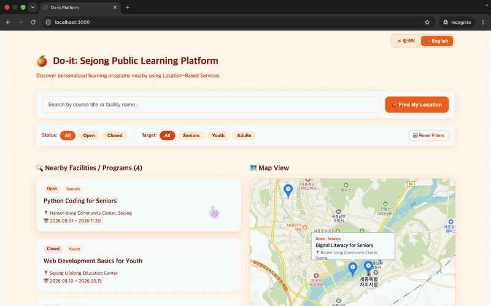
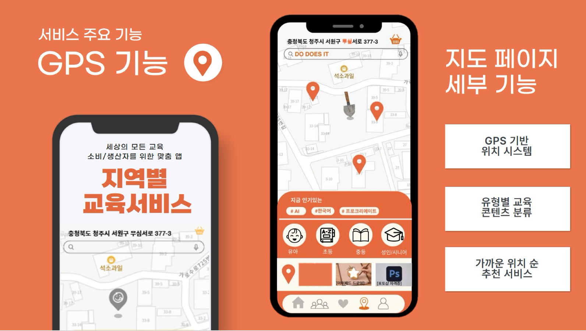

# 📱 Do-it: Public Data-Driven Educational Brokerage Platform

An EdTech platform leveraging public datasets and geospatial matching algorithms to connect local learners with community lifelong education ecosystems in Sejong City.


## 📱 서비스 시연 영상


---

## 🛠 Tech Stack & Architecture

- **Frontend:** React.js, JavaScript, Responsive Web UI
- **Backend:** Python (Flask), RESTful APIs, Geospatial LBS Integration
- **Database & Cloud:** AWS DynamoDB, AWS S3
- **Tools & Pipeline:** Git, GitHub Actions, Docker-ready Architecture

### 🏗 System Architecture Overview





## 📂 Repository Structure

```text
Do-it/
├── frontend/             # React-based user interface application
│   └── README.md
├── backend/              # Python REST API server & database services
│   ├── login.py          # AWS DynamoDB user authentication
│   ├── search_location.py# Kakao LBS geospatial search API
│   ├── mentoring.py      # Learner-mentor matching pipeline
│   ├── enrollment.py     # Program registration workflows
│   ├── todo.py           # Dashboard task management
│   ├── requirements.txt  # Project dependencies
│   └── .env.example      # Environment variables configuration
└── README.md
