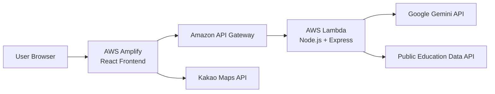

# Do-it 🌱

> **Find it. Learn it. Do-it.**  
> A location-based lifelong learning discovery platform with interactive maps and AI-powered course recommendations.

🌐 **Live Demo:**  
https://main.d2a0y45h62esgx.amplifyapp.com

---

## 🚀 Overview

**Do-it** is a full-stack educational discovery platform designed to help users find and explore nearby lifelong-learning opportunities.

The platform combines location-based course discovery, interactive mapping, filtering, favorites, bilingual support, and an AI course assistant in a single web application.

Users can:

- Discover nearby educational programs
- Explore course locations through an interactive map
- Search and filter courses
- Save favorite programs
- Switch between Korean and English
- Ask an AI assistant whether a course matches their needs
- Access the application through a fully deployed AWS serverless architecture

---

## 🏗️ Architecture



### Production Request Flow

```text
User
  ↓
React Frontend
  ↓
AWS Amplify
  ↓
Amazon API Gateway
  ↓
AWS Lambda
  ↓
Express REST API
  ├── Google Gemini API
  └── Public Education Data API
```

---

## ✨ Key Features

### 📍 Location-Based Course Discovery

Users can explore educational programs based on location and view them directly on a map.

The platform displays:

- Course title
- Facility information
- Registration period
- Registration status
- Target audience
- Geographic coordinates

Course cards and map markers are synchronized so users can easily move between program information and its location.

---

### 🗺️ Interactive Kakao Map

The frontend integrates the **Kakao Maps JavaScript SDK** to visualize learning opportunities geographically.

Supported features include:

- Dynamic map markers
- Automatic map bounds
- Marker selection
- Course-specific map movement
- Information windows
- Browser geolocation
- Current-location marker

---

### 🔎 Search & Filtering

Users can search educational programs and filter results by:

- Keyword
- Registration status
- Target audience
- Favorite courses

Search requests are sent from the React frontend to the backend REST API through **Amazon API Gateway**.

---

### ✨ AI Course Assistant

Each course includes an AI-powered assistant.

Users can ask questions such as:

> "I'm new to programming. Would this course be suitable for me?"

The request travels through the production infrastructure:

```text
React
  ↓
Amazon API Gateway
  ↓
AWS Lambda
  ↓
Express
  ↓
Google Gemini API
```

The AI analyzes:

- The user's question
- Course information
- Target audience
- Registration information

and returns a personalized recommendation.

---

### ⭐ Favorites

Users can save courses they are interested in.

Favorite course IDs are stored using browser `localStorage`, allowing users to quickly filter and revisit saved programs.

---

### 🌎 Korean / English Interface

Do-it supports both **Korean and English** without requiring a page refresh.

The selected language dynamically changes:

- Navigation labels
- Search interface
- Filters
- Course information
- AI assistant interface
- Map information windows

---

### 📍 Current Location

Users can allow browser geolocation to display their current location on the Kakao map.

The map automatically moves to the user's location and displays a dedicated marker.

---

## 🧰 Tech Stack

### Frontend

- React
- React Router
- JavaScript
- Kakao Maps JavaScript SDK
- Google OAuth
- Browser Geolocation API
- localStorage
- CSS-in-JS
- AWS Amplify

### Backend

- Node.js
- Express
- Axios
- Google Gemini API
- REST APIs
- dotenv

### AWS / Cloud

- AWS Amplify
- AWS Lambda
- Amazon API Gateway
- Amazon CloudWatch

### Development

- Git
- GitHub
- npm
- REST API testing with curl

---

## 🔌 API Endpoints

### Health Check

```http
GET /
```

Used to verify that the deployed Express application is running successfully inside AWS Lambda.

Example response:

```text
🚀 Do-it Backend Server is Running On Render!
```

---

### Search Courses

```http
GET /api/v1/locations/search
```

Example:

```text
/api/v1/locations/search?query=python&status=접수중&target=성인
```

The endpoint searches educational program data and returns course information to the frontend.

Example response structure:

```json
{
  "status": "success",
  "count": 4,
  "data": [
    {
      "id": 1,
      "titleKo": "파이썬 코딩 기초",
      "locationKo": "평생학습관",
      "status": "접수중",
      "target": "중장년",
      "lat": 35.1631,
      "lng": 129.1636
    }
  ]
}
```

The backend also includes fallback course data so the application remains usable when the upstream public-data API is unavailable or times out.

---

### AI Recommendation

```http
POST /api/v1/recommend/ai
```

Example request:

```json
{
  "userPrompt": "코딩 초보자인데 이 강좌가 저한테 맞을까요?",
  "courses": [
    {
      "id": 1,
      "titleKo": "부산 해운대구 주민을 위한 파이썬 코딩 기초",
      "locationKo": "부산 해운대구 평생학습관",
      "status": "접수중",
      "target": "중장년"
    }
  ],
  "lang": "ko"
}
```

Example response:

```json
{
  "status": "success",
  "recommendation": "..."
}
```

---

### Mock Login

```http
POST /api/v1/auth/login
```

The current authentication endpoint is implemented as a prototype login flow.

Future versions can replace this with persistent authentication using a managed identity or database-backed authentication system.

---

## 📁 Project Structure

```text
Do-it-
│
├── frontend/
│   ├── public/
│   │
│   ├── src/
│   │   ├── components/
│   │   │   └── CourseChat.jsx
│   │   │
│   │   └── App.jsx
│   │
│   ├── package.json
│   └── package-lock.json
│
├── backend/
│   ├── lambda.js
│   ├── server.js
│   ├── package.json
│   └── package-lock.json
│
├── .gitignore
└── README.md
```

---

## 💻 Running Locally

### 1. Clone the Repository

```bash
git clone https://github.com/hwmps/Do-it-.git
cd Do-it-
```

---

### 2. Install Backend Dependencies

```bash
cd backend
npm install
```

Create a `.env` file inside the backend directory:

```env
GEMINI_API_KEY=your_gemini_api_key
PUBLIC_DATA_API_KEY=your_public_data_api_key
PORT=5000
```

> API keys should never be committed to GitHub.

Run the backend:

```bash
npm start
```

The local backend runs at:

```text
http://localhost:5000
```

---

### 3. Install Frontend Dependencies

Open another terminal:

```bash
cd frontend
npm install
```

Run the frontend:

```bash
npm start
```

The application automatically uses different API endpoints depending on its environment.

```text
Development → http://localhost:5000
Production  → Amazon API Gateway
```

---

## ☁️ AWS Deployment

### Frontend — AWS Amplify

The React application is continuously deployed through **AWS Amplify**.

```text
GitHub main branch
       ↓
AWS Amplify Build
       ↓
Production React Application
```

Production URL:

```text
https://main.d2a0y45h62esgx.amplifyapp.com
```

A push to the GitHub `main` branch automatically triggers a new Amplify build and deployment.

---

### Backend — AWS Lambda

The Node.js / Express backend is deployed as a serverless Lambda application.

The existing Express app is wrapped with a Lambda-compatible serverless Express adapter.

```text
lambda.js
   ↓
Express Application
   ↓
AWS Lambda
```

This allowed the original REST API structure to be preserved while moving the backend from a traditional local server to a serverless environment.

---

### API Layer — Amazon API Gateway

Amazon API Gateway provides the public HTTP interface between the frontend and Lambda.

```text
Browser
   ↓
Amazon API Gateway
   ↓
AWS Lambda
   ↓
Express Routes
```

The frontend calls the production API through the API Gateway endpoint rather than directly communicating with Lambda.

---

### Monitoring — Amazon CloudWatch

AWS CloudWatch is used to inspect Lambda executions and debug production issues.

CloudWatch logging was used during deployment to diagnose:

- Lambda runtime errors
- Gemini API errors
- HTTP request failures
- API Gateway integration behavior
- Execution duration
- Memory usage

---

## 🔐 Security

Sensitive credentials are stored outside the Git repository.

The project does **not** commit:

```text
.env
node_modules/
build/
*.zip
```

Production API credentials are configured using AWS Lambda environment variables.

Examples include:

```text
GEMINI_API_KEY
PUBLIC_DATA_API_KEY
```

This prevents secret keys from being embedded directly in the repository.

---

## 🧠 Engineering Challenges

### 1. Migrating Express to AWS Lambda

The backend was initially designed as a traditional Express server.

To deploy it using a serverless architecture, the application was adapted to run inside AWS Lambda while preserving the existing Express REST API routes.

---

### 2. Connecting a Separately Hosted Frontend and Backend

The frontend runs on AWS Amplify while the backend runs on Lambda behind API Gateway.

This required replacing local development URLs such as:

```text
http://localhost:5000
```

with environment-aware production API routing.

The application now automatically chooses between local and production endpoints.

---

### 3. Configuring CORS

Because the frontend and backend are hosted on different domains, browser requests were initially blocked by CORS.

Amazon API Gateway CORS configuration was added to allow requests from the production Amplify domain.

Allowed production origin:

```text
https://main.d2a0y45h62esgx.amplifyapp.com
```

Configured methods include:

```text
GET
POST
OPTIONS
```

---

### 4. Integrating Gemini in a Serverless Environment

The AI recommendation endpoint sends user questions and course information from the React application to Gemini through the backend.

The complete production request flow is:

```text
User Question
      ↓
React
      ↓
API Gateway
      ↓
Lambda
      ↓
Express
      ↓
Gemini
      ↓
AI Recommendation
      ↓
React UI
```

This keeps the Gemini API key on the server side rather than exposing it directly in the browser.

---

### 5. Production Debugging

Several deployment issues were diagnosed and resolved during the AWS migration, including:

- Lambda runtime compatibility
- Serverless Express integration
- API Gateway route configuration
- Lambda environment variables
- AI model configuration
- Frontend production API routing
- React runtime errors
- Cross-origin requests
- CloudWatch debugging

These issues required debugging across both application code and cloud infrastructure.

---

### 6. Resilient External Data Loading

External public APIs may:

- Time out
- Return unexpected responses
- Become temporarily unavailable

To prevent the entire user interface from failing, the application includes fallback educational program data.

This keeps the core course discovery experience available even when the external data provider cannot be reached.

---

## 📚 What I Learned

Building and deploying Do-it provided hands-on experience across the full application lifecycle:

- Designing REST APIs
- Building React interfaces
- Integrating external APIs
- Working with geographic data
- Integrating generative AI
- Managing environment variables
- Deploying frontend applications with AWS Amplify
- Running Express applications on AWS Lambda
- Configuring Amazon API Gateway
- Debugging production services with CloudWatch
- Handling CORS between independently deployed services
- Separating local and production configurations
- Managing Git-based continuous deployment

---

## 🔭 Future Improvements

Potential next steps include:

- Persist user accounts in a database
- Store favorites server-side
- Expand educational program coverage beyond the initial region
- Add personalized recommendations across multiple courses
- Add persistent user profiles
- Implement production-grade authentication
- Add automated unit and integration tests
- Add CI validation before deployment
- Improve error monitoring and structured logging
- Add API response caching
- Improve accessibility and responsive design
- Add custom domain support
- Add infrastructure-as-code deployment

---

## 👩‍💻 Author

**Helena Kim**  
Computer Science, Stony Brook University

GitHub: https://github.com/hwmps

---

## 🌱 About Do-it

Do-it started from a simple question:

> **How can people more easily discover learning opportunities around them?**

By combining location-based discovery, cloud infrastructure, and AI-powered recommendations, Do-it explores how software can make local education more accessible and easier to navigate.

**Find it. Learn it. Do-it.**
